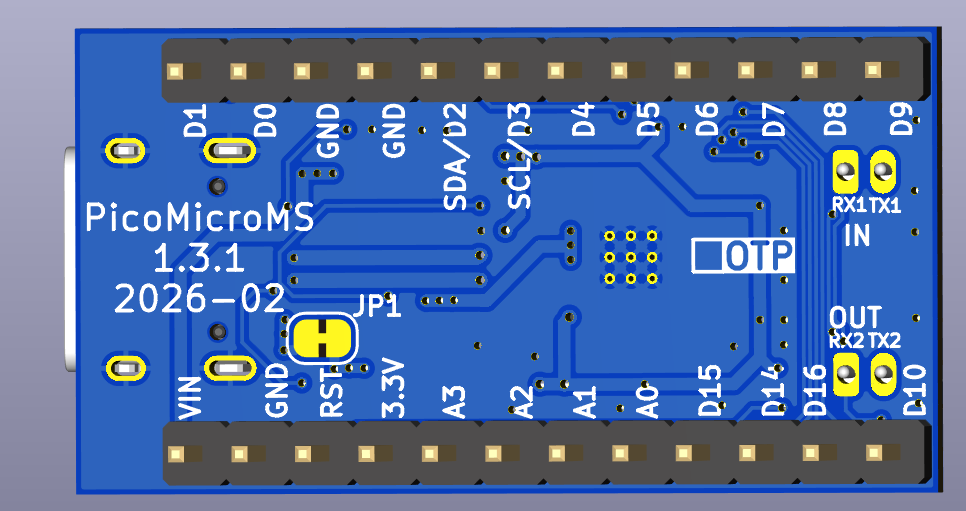
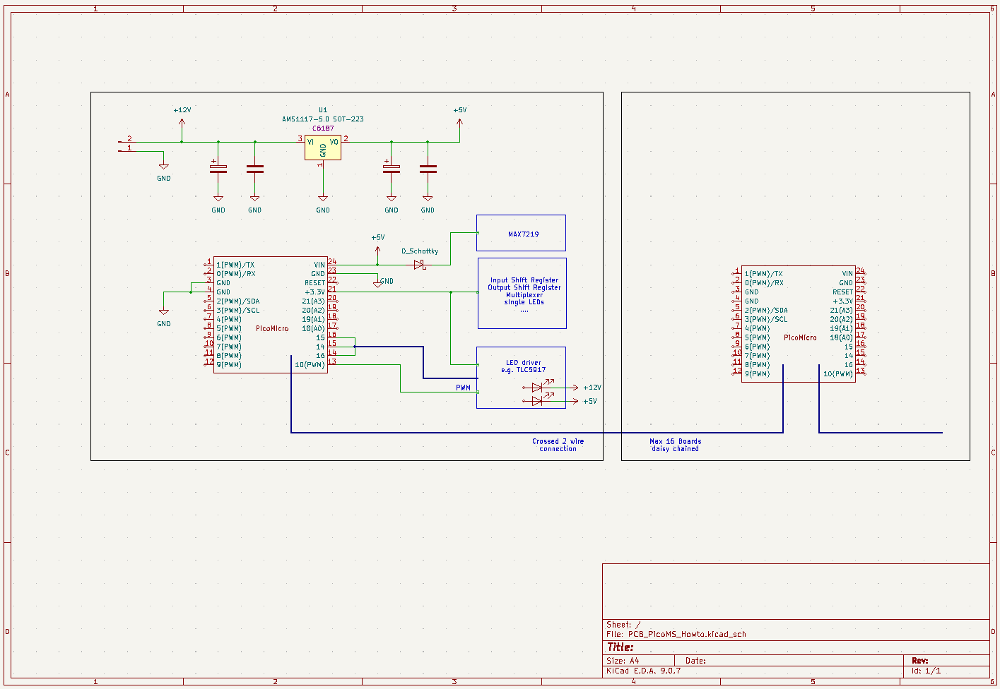

# Firmware for Pico Boards with Master/Slave operation

## General
The PicoMicro/MS is intended for a replacement of an Arduino ProMicro. It is based on the PicoMicro but has two additional connectors on board for setting up a chain.
In the Master/Slave version two additional JST-SH connectors and two LED's are placed on the board.
These connectors are foreseen two daisy chain up to 16 boards. Only the first board in the chain, called Master, has to be connected to USB. All other daisy chained boards are called Slaves and don't need a USB connection for normal operation.
Each device from a Slave will also show up as a device in the Master.

 

The PicoNano can also be used with Master/Slave firmware which is part of the releases. The additional two connectors must be placed by yourself on yout board design.
Both connectors are two pin connectors. Connector for connection to Master uses Pin `0` for TX and Pin `1` for RX, for connection to Slave Pin `24` for TX and Pin `25` for RX.
These Pins are not available for devices.

All boards are coming with the latest release when purchased.

## Requirements
* The first board in the chain is always the Master Board. This has to be connected via USB to the PC for normal operation.
* All boards should be switched *ON* at the same time, so a common power supply for all boards is recommended.
Nevertheless Master and Slaves are hotplug capable. After rebooting one, like updating the Firmware, the chain gets build up again automatically.

## Restrictions
* The configuration for the Master has to be uploaded without any connected Slave. Temporarily unplug the JST connector to the first Slave.
* To upload a configuration to a Slave, connect him directly to USB and program this board with the Mobiflight connector. After uploading the configuration, close the "Setttings" Window and open it again to reload the configuration from the Master. It is **not** required to unpower the chain and to unplug the USB connection of the Master.

## Features
* A succesfull build up chain will be signalized with two Onboard LED's. Both LED's are located near the respective JST connector. If the LED lights up, a connection on this serial line is established. 
The LED near the output connector indicates that this board is a Slave. When the LED near the connector to a Slave lights up, another Slave in the chain is detected. For the last Slave in the chain this LED will not light up.
Same applies for the LED near the input connector, if this LED lights up a connection to a Master is established.
* All devices from the Master and all Slaves will shown up in the Mobiflight connector as if they are from the Master. To keep the overview which device belongs to which board, the boardname will be the prefix of each device.
Example: If a board is named "ELEC", and on this board an inputshifter is named "InShifter1", this device will show up with the name "ELEC-InShifter1". This helps to keep the overview when multiple boards are in the chain especially when a device name is identical in some Slaves.

(Remark: PicoNano does not have these LEDs to have most pins as I/Os available)

## Wiring
To daisy chain all boards, first define which board is the Master. It is a good idea to have a separate Master without any config uploaded. As this board does not have any configured device it's not needed to unplug the connection and reboot the board for uploading or changing the configuration. Name this board before setting up the chain to an appropiate name which reflects all Slave, e.g. "OVHD" for an overhead Panel or "PED" for pedestal.
Connect the output of the master to the input of the first Slave. Continue the chain by connecting the output of the first slave to the input of the next slave, and so on. On the last board no cable is connected to the Output.

⚠️ Important: All cables must have a crossed wiring.

## Limitations 
While this board is highly compatible, there are a few important differences:

1. **Analog Inputs**  
   - Only **A0 to A3** are available (4 total)  
   - Other analog pins present on the Pro Micro are not supported  

2. **5V Output (Pin 21)**  
   - On the Arduino Pro Micro, Pin 21 outputs **5V**  
   - On this board, Pin 21 outputs **3.3V**  

3. **MAX7219 & 5V Requirement**  
   - The MAX7219 driver must still be powered with **5V**  
   - Therefore, an **external 5V source** is required, or you can use **Pin 24 (Vin)**, which provides 5V directly from the USB connector  

4. **Level Shifting for MAX7219**  
   - The MAX7219 requires **5V logic levels**  
   - Use a **level shifter** between the PicoMicro board (3.3V signals) and the MAX7219 inputs
   - Alternative supply the MAX7219 via a diode with 5V. This reduces the supply voltage to ~4.4V and the logic levels of 3.3V are within the required 70% of supply voltage

5. **Bootloader Button**  
   - The board includes a **dedicated BOOT button** to enter USB mass storage boot mode (for firmware flashing).

## 📊 PicoMicro vs. Arduino Pro Micro (ATmega32U4)

| Feature  | PicoMicro ProMicro                          | Arduino Pro Micro (ATmega32U4) |
|----------|-------------------------------------------|--------------------------------|
| MCU      | Dual-core ARM Cortex-M33 @ up to 150 MHz, FPU, DSP | 8-bit AVR @ 16 MHz |
| Flash    | Up to 16 MB QSPI (typ. 2–8 MB onboard)    | 32 KB |
| RAM      | 512 KB                                    | 2.5 KB |
| USB      | Native USB 2.0 FS/HS, multiple device classes | Native USB 2.0 FS (limited) |
| I/O      | **3.3 V logic, 5 V-tolerant pins**        | 5 V I/O (native) |
| Analog   | 4 (A0–A3 only)                            | 12 (depending on variant) |
| Extra HW | 2× PIO, Crypto engine, more UART/SPI/I²C | – |
| Power    | Low-power modes, efficient ARM design     | Limited power saving |